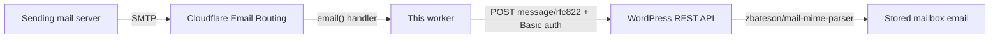

# bh-wp-mailboxes — Cloudflare incoming email worker

A Cloudflare Worker that receives email via [Cloudflare Email Routing](https://developers.cloudflare.com/email-service/get-started/route-emails/)
and delivers the raw MIME message, unmodified, to the WordPress REST API endpoint provided by
the bh-wp-mailboxes plugin. Mail to `anything@example-mail.com` becomes a `POST` to
`https://example.org/wp-json/…/incoming-email` — the receiving email domain is independent
of the WordPress site's domain.

This directory lives inside the bh-wp-mailboxes plugin repository but is **deployed
independently** with Wrangler. See [PLAN.md](./PLAN.md) for the design decisions and the
worker ⇄ plugin ingress contract.

## How it works



- Which addresses reach the worker is controlled entirely by the zone's Email Routing
  rules; the worker delivers whatever it receives, regardless of recipient domain.
- The destination is **discovered and selected**, not hard-coded: the setup flow follows
  `Link` header → `/wp-json/` index → `email_ingress_endpoints` key (namespace-agnostic).
  A site may advertise several ingress endpoints (one per mailbox/library instance); the
  administrator selects the one this worker delivers to (selected automatically when only
  one is advertised). The worker delivers to that endpoint and nowhere else.
- Authentication uses a WordPress application password obtained via the core
  authorization flow (`/setup` route below) and sent as HTTP Basic auth.
- On transient failure (site down, setup incomplete, endpoint refusing) the handler
  throws, so the **sending** server retries — and, when configured, the worker emails the
  administrator (at most once per day) through Cloudflare Email Routing's `send_email`
  binding, independent of the WordPress site. A message is rejected permanently only when
  it exceeds the selected endpoint's size limit.
- The email's `Message-ID` is the idempotency key; WordPress upserts on retries.

## Setup

1. Create the KV namespace and set the secret:

   ```sh
   npx wrangler kv namespace create WORKER_CONFIGURATION_KV   # put the id in wrangler.jsonc
   npx wrangler secret put SETUP_TOKEN                        # any long random string
   ```

2. Set `TARGET_WORDPRESS_SITE_URL` in `wrangler.jsonc`, then deploy:

   ```sh
   npx wrangler deploy
   ```

3. In the Cloudflare dashboard, enable Email Routing for the receiving zone and add a
   catch-all rule sending to this worker. Email Routing does not support subdomains, so
   the receiving zone must be a root domain — it can be a different domain than the
   WordPress site (e.g. mail to `example-mail.com`, site at `example.org`).

4. Authorize against WordPress (requires the bh-wp-mailboxes plugin active on the site and
   an HTTPS site): visit

   ```
   https://<worker-host>/setup?token=<SETUP_TOKEN>
   ```

   log in as the dedicated low-privilege WordPress user created for email ingress, and
   approve. The credential is stored in KV; the confirmation page never displays it.
   The callback then lists the site's advertised ingress endpoints: with exactly one it
   is selected automatically, otherwise choose the destination mailbox on the selection
   form. Re-run this step to change the destination later.

5. (Optional) Enable delivery-failure alert emails: uncomment the `send_email` binding
   and the `ALERT_FROM_EMAIL_ADDRESS` / `ALERT_RECIPIENT_EMAIL_ADDRESS` vars in
   `wrangler.jsonc` and redeploy. The recipient must be a verified Email Routing
   destination address on the worker's zone. At most one alert is sent per day.

## Configuration reference

| Name                            | Kind                          | Purpose                                                                 |
| ------------------------------- | ----------------------------- | ----------------------------------------------------------------------- |
| `TARGET_WORDPRESS_SITE_URL`     | env var                       | Base URL of the WordPress site (e.g. `https://sacramentogaa.org`).      |
| `SETUP_TOKEN`                   | secret                        | Gates the `/setup` and `/setup/callback` routes.                        |
| `WORKER_CONFIGURATION_KV`       | KV namespace                  | Selected endpoint + application-password credential + alert rate limit. |
| `ALERT_EMAIL`                   | send_email binding (optional) | Sends delivery-failure alerts via Email Routing.                        |
| `ALERT_FROM_EMAIL_ADDRESS`      | env var (optional)            | Alert sender address on the worker's zone.                              |
| `ALERT_RECIPIENT_EMAIL_ADDRESS` | env var (optional)            | Alert recipient (verified Email Routing destination).                   |

## Development

```sh
npm install
npm run check     # lint (ESLint + Prettier) + typecheck + unit tests — must pass before every commit
```

### Testing tiers

**1. Unit tests (every change, CI):**

```sh
npm run test
```

Fixtures live in `tests/fixtures/*.eml` (raw RFC 5322, CRLF line endings, must include a
`Message-ID` header). Add a fixture for any new message shape you handle.

**2. Local integration (no email infrastructure):**

```sh
npx wrangler dev
scripts/send-fixture-local.sh tests/fixtures/plain-text-simple.eml
```

This POSTs the fixture to `wrangler dev`'s simulated email endpoint
(`/cdn-cgi/handler/email`). Point `TARGET_WORDPRESS_SITE_URL` at a local WordPress
(`http://localhost:…` is allowed and skips the https check) to exercise the whole
pipeline on one machine.

No local WordPress? `scripts/fake-wordpress-ingress-server.mjs` fakes the WordPress side of
the contract (REST index discovery + ingress endpoint) and saves each received message to
`received-emails/<n>.eml` so it can be diffed against the fixture:

```sh
node scripts/fake-wordpress-ingress-server.mjs                    # port 8899
echo 'TARGET_WORDPRESS_SITE_URL=http://localhost:8899' >  .dev.vars
echo 'SETUP_TOKEN=local-dev-token'                     >> .dev.vars
npx wrangler dev
curl 'http://localhost:8787/setup/callback?token=local-dev-token&site_url=http%3A%2F%2Flocalhost%3A8899&user_login=test&password=test'
scripts/send-fixture-local.sh tests/fixtures/plain-text-simple.eml
diff tests/fixtures/plain-text-simple.eml received-emails/1.eml   # byte-for-byte
```

**3. Live test (deployed worker, real email):**

```sh
scripts/send-fixture-live.sh tests/fixtures/plain-text-simple.eml mailbox@p.sacramentogaa.org
npx wrangler tail                                             # watch the worker logs
scripts/verify-delivery.sh '<plain-text-simple-fixture@bh-wp-mailboxes.test>'
```

`send-fixture-live.sh` sends the fixture through an authenticated SMTP relay using
[swaks](https://github.com/jetmore/swaks) (`brew install swaks`). Note: relays rewrite some
headers (`From:`, DKIM), so live tests validate the pipeline; byte-exact MIME handling is
covered by tiers 1–2. There is no usable command-line interface to macOS Mail.app for
sending a raw `.eml` verbatim — use swaks.

`verify-delivery.sh` polls the WordPress REST API for the fixture's `Message-ID` and exits
non-zero on timeout, so it can gate scripts.

## Pull requests

Every PR touching this directory should include: unit tests for the change, a screenshot
(e.g. `wrangler tail` output, the WordPress admin screen showing the stored email), and the
manual live-test commands run with their result. CI runs `npm run check` via
`.github/workflows/cloudflare-worker.yml`.
