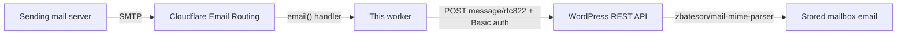

# bh-wp-mailboxes — Cloudflare incoming email worker

[](https://deploy.workers.cloudflare.com/?url=https://github.com/BrianHenryIE/bh-wp-mailboxes-cloudflare-worker)

A Cloudflare Worker that receives email via [Cloudflare Email Routing](https://developers.cloudflare.com/email-service/get-started/route-emails/)
and delivers the raw MIME message, unmodified, to the WordPress REST API endpoint provided by
the bh-wp-mailboxes plugin. Mail to `anything@example-mail.com` becomes a `POST` to
`https://example.org/wp-json/…/emails-cpt/new` — the receiving email domain is independent
of the WordPress site's domain.

This is the companion worker to the
[bh-wp-mailboxes](https://github.com/BrianHenryIE/bh-wp-mailboxes) WordPress plugin/library,
which provides the receiving REST endpoint. See [PLAN.md](./PLAN.md) for the design
decisions and the worker ⇄ plugin ingress contract.

The **Deploy to Cloudflare** button above clones this repository into your GitHub/GitLab
account, provisions the KV namespace declared in `wrangler.jsonc`, and deploys with
Workers Builds — replacing steps 1–2 below. Afterwards set the `SETUP_TOKEN` secret
(step 2's second command) and continue from step 3.

## How it works



- Which addresses reach the worker is controlled entirely by the zone's Email Routing
  rules; the worker delivers whatever it receives, regardless of recipient domain.
- The destination is **discovered and selected**, not hard-coded: the setup flow follows
  `Link` header → `/wp-json/` index → `email_ingress_endpoints` key (namespace-agnostic).
  A site may advertise several ingress endpoints (one per mailbox instance); the
  administrator selects the one this worker delivers to (selected automatically when only
  one is advertised). The worker delivers to that endpoint and nowhere else.
- Authentication uses a WordPress application password obtained via the core
  authorization flow (`/setup` route below) and sent as HTTP Basic auth.
- On transient failure (site down, setup incomplete, endpoint refusing) the handler
  throws, so the **sending** server retries — and, when configured, the worker emails the
  administrator (at most once per day) through Cloudflare Email Routing's `send_email`
  binding, independent of the WordPress site. A message is rejected permanently only when
  it exceeds the selected endpoint's size limit. (SMTP typically retries so there is no need for the worker to manage retries)
- The email's `Message-ID` is the idempotency key; WordPress upserts on retries.

## Setup

```sh
npm install          # wrangler is a dev dependency, run via npx
npx wrangler login   # authenticates the CLI against your Cloudflare account
```

1. Create the KV namespace (account-level, works before any deploy):

   ```sh
   npx wrangler kv namespace create WORKER_CONFIGURATION_KV   # put the returned id in wrangler.jsonc
   ```

2. Deploy — this creates the worker on Cloudflare:

   ```sh
   npx wrangler deploy
   ```

   The setup token — a secret password protecting the worker's setup pages — is chosen
   on the web UI at your first visit to `/setup` (step 4), and can easily be re-set if
   lost/forgotten (delete the `setup_token_sha256` KV entry). Optionally pre-set it as a
   secret instead, which takes precedence and disables the web-UI claim:

   ```sh
   openssl rand -hex 32 | npx wrangler secret put SETUP_TOKEN
   ```

   **Visit `/setup` promptly after deploying**: until a token exists, whoever reaches
   the page first can claim the worker.

3. Configure Email Routing for the receiving zone — easiest from the worker's own
   `/setup` page (next step): paste a Cloudflare API token scoped to the zone
   (_Zone → Read_, _DNS → Edit_, _Email Routing Rules → Edit_; plus
   _Account → Email Routing Addresses → Edit_ if registering an alert destination
   address) and the worker enables Email Routing and routes mail to itself — the
   catch-all rule, or a rule for one specific incoming address. It can also register the
   alert destination address (Cloudflare then emails a verification link to click). The
   token is used for that one request and never stored. Alternatively use the Cloudflare
   dashboard, or `curl` — see [PLAN-SETUP.md](./PLAN-SETUP.md). Email Routing does not
   support subdomains, so the receiving zone must be a root domain — it can be a
   different domain than the WordPress site (e.g. mail to `example-mail.com`, site at
   `example.org`).

4. Run the web setup flow: visit

   ```
   https://<worker-host>/setup
   ```

   - **Setup token** — on the very first visit a random token is suggested; save it in a
     password manager (only its hash is stored, so it cannot be shown again). Every later
     visit requires `/setup?token=<your token>`.
   - **Site URL** — enter the WordPress site that will receive incoming email (a bare
     domain like `example.org` is fine — `https://` is added automatically; the
     bh-wp-mailboxes plugin must be active there). Stored in KV — there is no site URL
     in `wrangler.jsonc`.
   - **Authorize** — you are redirected to the site's `authorize-application.php`; log in
     as the dedicated low-privilege WordPress user created for email ingress and approve.
     The credential is stored in KV; the confirmation page never displays it. If WordPress
     says application passwords are unavailable, see
     [troubleshooting](#application-passwords-are-not-available) below.
   - **Destination** — the callback lists the site's advertised ingress endpoints: with
     exactly one it is selected automatically, otherwise choose the destination mailbox
     on the selection form.
   - **Alerts (optional)** — the confirmation page asks where to email delivery-failure
     alerts (at most once per day, sent through Cloudflare Email Routing so they work even
     when the site is down). The recipient field is pre-filled with the WordPress admin
     email when the authorized user can read it; the recipient must be a verified Email
     Routing destination address on the worker's zone (the UI explains how, and a
     **Send test email** button confirms the addresses work end-to-end). Leave both
     fields blank to disable alerts.

   Re-run this step any time to change the site, the destination mailbox, or the alert
   addresses.

### "Application passwords are not available."

If `authorize-application.php` shows this, WordPress's
`wp_is_application_passwords_available()` is returning false on the site:

- **Wordfence** disables application passwords by default. In WP admin, go to
  `admin.php?page=WordfenceOptions` and under **Brute Force Protection** uncheck
  **"Disable WordPress application passwords"**, then save.
- **HTTPS not detected**: core requires `is_ssl()`. Behind a TLS-terminating proxy the
  origin may see plain HTTP — add to `wp-config.php` above the `wp-settings.php` require:

  ```php
  if ( isset( $_SERVER['HTTP_X_FORWARDED_PROTO'] ) && 'https' === $_SERVER['HTTP_X_FORWARDED_PROTO'] ) {
      $_SERVER['HTTPS'] = 'on';
  }
  ```

- Diagnose which it is:

  ```sh
  wp eval 'var_dump( wp_is_application_passwords_available(), is_ssl(), wp_get_environment_type() );'
  ```

## Configuration reference

| Name                      | Kind               | Purpose                                                                                                                                                      |
| ------------------------- | ------------------ | ------------------------------------------------------------------------------------------------------------------------------------------------------------ |
| `SETUP_TOKEN`             | secret (optional)  | Gates the `/setup` routes; overrides the web-UI-claimed token in KV.                                                                                         |
| `WORKER_CONFIGURATION_KV` | KV namespace       | Setup token hash + site URL + selected endpoint + application-password credential + alert addresses + alert rate limit. All entered via the `/setup` web UI. |
| `ALERT_EMAIL`             | send_email binding | Sends delivery-failure alerts via Email Routing. Always deployed; inert until alert addresses are entered on the setup UI.                                   |

## Development

```sh
npm install
npm run check     # lint (ESLint + Prettier) + typecheck + unit tests — must pass before every commit
```

### Testing tiers

**1. Unit tests (every change, CI):**

```sh
npm run test
```

Fixtures live in `tests/fixtures/*.eml` (raw RFC 5322, CRLF line endings, must include a
`Message-ID` header). Add a fixture for any new message shape you handle.

**2. Local integration (no email infrastructure):**

```sh
npx wrangler dev
scripts/send-fixture-local.sh tests/fixtures/plain-text-simple.eml
```

This POSTs the fixture to `wrangler dev`'s simulated email endpoint
(`/cdn-cgi/handler/email`). Enter a local WordPress URL on the `/setup` form
(`http://localhost:…` is allowed and skips the https check) to exercise the whole
pipeline on one machine.

No local WordPress? `scripts/fake-wordpress-ingress-server.mjs` fakes the WordPress side of
the contract (REST index discovery + ingress endpoint) and saves each received message to
`received-emails/<n>.eml` so it can be diffed against the fixture:

```sh
node scripts/fake-wordpress-ingress-server.mjs                    # port 8899
echo 'SETUP_TOKEN=local-dev-token' > .dev.vars
npx wrangler dev
# Set the site URL (the browser form, done with curl), then simulate the authorize callback:
curl -X POST http://localhost:8787/setup --data 'token=local-dev-token&site_url=http%3A%2F%2Flocalhost%3A8899'
curl 'http://localhost:8787/setup/callback?token=local-dev-token&site_url=http%3A%2F%2Flocalhost%3A8899&user_login=test&password=test'
scripts/send-fixture-local.sh tests/fixtures/plain-text-simple.eml
diff tests/fixtures/plain-text-simple.eml received-emails/1.eml   # byte-for-byte
```

**3. Live test (deployed worker, real email):**

```sh
scripts/send-fixture-live.sh tests/fixtures/plain-text-simple.eml mailbox@p.sacramentogaa.org
npx wrangler tail                                             # watch the worker logs
scripts/verify-delivery.sh '<plain-text-simple-fixture@bh-wp-mailboxes.test>'
```

`send-fixture-live.sh` sends the fixture through an authenticated SMTP relay using
[swaks](https://github.com/jetmore/swaks) (`brew install swaks`). Note: relays rewrite some
headers (`From:`, DKIM), so live tests validate the pipeline; byte-exact MIME handling is
covered by tiers 1–2. There is no usable command-line interface to macOS Mail.app for
sending a raw `.eml` verbatim — use swaks.

`verify-delivery.sh` polls the WordPress REST API for the fixture's `Message-ID` and exits
non-zero on timeout, so it can gate scripts.

## Pull requests

Every PR touching this directory should include: unit tests for the change, a screenshot
(e.g. `wrangler tail` output, the WordPress admin screen showing the stored email), and the
manual live-test commands run with their result. CI runs `npm run check` via
`.github/workflows/check.yml`.
